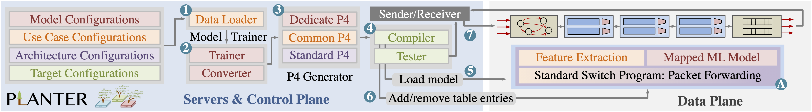

# Planter

[](https://opensource.org/licenses/Apache-2.0)


## Introducing Planter
Planter is a modular framework for realizing one-click in-network machine learning algorithms. All you need to provide to Planter are a configuration file (```Name_data.py```) and a dataset. Planter will take it from there and offload your machine learning classification task into a programmable data plane. This is the artifact for the paper "[Planter: Rapid Prototyping of In-Network Machine Learning Inference](https://eng.ox.ac.uk/media/zetja3ek/zheng24planter.pdf)" in SIGCOMM CCR [[video]](https://www.youtube.com/watch?v=ZVXNpUwgSi0) (with early arXiv version named "[Automating In-Network Machine Learning](https://arxiv.org/pdf/2205.08824.pdf)".) 

💡 **Please check Planter's user manual** [PDF](./Docs/Planter_User_Document_v0.1.0.pdf) (strongly recommended). 

## Setting up the Planter environment <span id = "environment"></span>

Planter requires python3+, with the packages listed in [requirements_pip3.txt](./src/configs/requirements_pip3.txt). To install the aforementioned packages, start your working environment and execute the following command:

```
pip3 install -r ./src/configs/requirements_pip3.txt
``` 
Some packages need to be installed using sudo python3:

```
sudo pip3 install -r ./src/configs/requirements_sudo_pip3.txt
``` 
- Common Issues in Environment Setup [wiki](./src/help/Common_Issues/Envronment_Issues.md).

## Getting started with Planter

First, prepare a working environment as described in the previous section [Link](#environment). 

Run the following command to start Planter in manual configuration mode. 

```
python3 Planter.py -m
``` 

Use help (```-h```) to see additional command options, e.g., ```-t```, and ```-d```. 

💡 A detailed getting started tutorial [Link](./src/help/Sample_Tutorial/Planter_Tutorial.md) (strongly recommended). 


## Planter Supports

- Planter Supported Algorithms [wiki](./src/help/Planter_Supports/Planter_Supported_Algorithms.md)
- Planter Supported Architectures [wiki](./src/help/Planter_Supports/Planter_Supported_Architectures.md)
- Planter Supported Targets [wiki](./src/help/Planter_Supports/Planter_Supported_Targets.md)
- Planter Supported Use Cases [wiki](./src/help/Planter_Supports/Planter_Supported_Use_Cases.md)
- Planter Supported Datasets [wiki](./src/help/Planter_Supports/Planter_Supported_Datasets.md)

## The Planter Workflow

### Model Trainer & Converter:

Model training, model conversion (table generation), and (python based) checking of generated table entries, are all done by a ```table_generator.py``` file. The file is located under the ```src/models``` folder, within each ```model_name/type_n``` folder. For example, ```/src/models/RF/Type_EB```. All the table entries, registers, and constants needed in the pipeline are generated by this file, which is unique per machine learning model mapping.

### P4 Generator:
Planter supports multiple target architectures architectures. Architectures are located under ```src/architectures/```. In each architecture's folder, there is a file called ```p4_generator.py```  that manages and calls all the files required to generate code ```MODEL.usecase_datasetp4``` for a switch model.

Specifically, two essential files are called. The first one is ```common_p4.py``` (located under the use-case folder ```src/use_cases/<use_case_name>```. 
This file includes the common P4 code ([What is P4?](https://p4.org/)) that is used by this use case. 
The second file is ```dedicate_p4.py``` under the model folder ```./src/models/<model_name>/<type_n>```. 
The essential p4 code required by the chosen model is stored in this file.

### Model Compiler & Tester:
A generated p4 file will be compiled and loaded to the target using dedicated targets scripts under ```/src/targets/<target_name>```. The compiler will further load the generated M/A table entries (or registers) to the target device. The model tester (```test_model.py``` under the same folder) will send packets to the target to verify its functionality.


## Simple Test Guide:
### Getting Start Tutorial: (💡strongly recommend) 
A detailed tutorial [wiki](./src/help/Sample_Tutorial/Planter_Tutorial.md), provides an example step-by-step guide of running a sample RF model on BMv2.
### Output Matrix: 
Generally, each test will have three classification performance matrix outputs. Each matrix has a similar structure, as shown below:
```  
               precision    recall  f1-score   support
 
           0     1.0000    1.0000    1.0000        13
           1     0.9500    0.9500    0.9500        20
           2     0.9167    0.9167    0.9167        12

    accuracy                         0.9556        45
   macro avg     0.9556    0.9556    0.9556        45
weighted avg     0.9556    0.9556    0.9556        45
```
- The first matrix: The classification performance of the scikit-learn model in Python (i.e., on a host).
- The second matrix: The classification performance of the pipeline logic by using the generated table entries in Python (i.e., theoretical).
- The third matrix: The classification result of the generated P4 on either software/hardware programmable network devices or its emulation environment (i.e., actual).

A more detailed matrix is shown in the sample tutorial [wiki](./src/help/Sample_Tutorial/Planter_Tutorial.md)
### Performance Mode: 
To test Planter in performance mode, configure the model by using the following table. The table shows what mapping (```EB```, ```LB```, or ```DM```) can be used in each type of model when choosing the use case ```performance```. As manual optimization is applied, the mappings supported by performance mode consume fewer stages but only match the performance use case. 

| Use case  | DT      | RF      | XGB     | IF | SVM | NB    | KM      | KNN | PCA | AE   | NN  |
|-----------|---------|---------|---------|----|-----|-------|---------|-----|-----|------|-----|
| Mapping   | EB & DM | EB & DM | EB & DM | EB | LB  | LB    | LB & EB | EB  | LB  | LB   | DM  |
### Throughput Test: 
To test Planter's mapped models' throughput on a P4Pi-enabled BMv2, follow the throughput test [wiki](./src/help/Throughput_Test/Planter_throughput_test_P4Pi-BMv2.md).

## Adding Your Own Design
- Adding your own model [wiki](./src/help/Adding_Your_Own_Design/Adding_model.md)
- Adding your own architecture [wiki](./src/help/Adding_Your_Own_Design/Adding_architecture.md)
- Adding your own target [wiki](./src/help/Adding_Your_Own_Design/Adding_target.md)
- Adding your own use case [wiki](./src/help/Adding_Your_Own_Design/Adding_use_case.md)
- Adding your own dataset [wiki](./src/help/Adding_Your_Own_Design/Adding_dataset.md)


## Reporting a Bug
Please submit an issue with the appropriate label on [Github](../../issues).

## License

The files are licensed under Apache License: [LICENSE](./LICENSE). The text of the license can also be found in the LICENSE file.

## Applications
Please access the Planter project's history and recent applications through the [link](./Docs/Projects.md). If your work uses Planter, please kindly email us if possible. We will include your latest publication or project in the application list.

## Citation
If you use this code, please cite our [paper](https://eng.ox.ac.uk/media/zetja3ek/zheng24planter.pdf):

```
@article{zheng2024automating,
  title={{Planter: Rapid Prototyping of In-Network Machine Learning Inference}},
  author={Zheng, Changgang and Zang, Mingyuan and Hong, Xinpeng and Perreault, Liam and Bensoussane, Riyad and Vargaftik, Shay and Ben-Itzhak, Yaniv and Zilberman, Noa},
  journal={ACM SIGCOMM Computer Communication Review},
  year={2024}
}
```


## Acknowledgments

The following people contributed to this project: Changgang Zheng, Mingyuan Zang, Xinpeng Hong, Liam Perreault, Riyad Bensoussane, Shay Vargaftik, Yaniv Ben-Itzhak, and Noa Zilberman. In addition, Peng Qian contributed to this repository. This work was partly funded by VMware and the EU Horizon SMARTEDGE (101092908, UKRI 10056403). We acknowledge support from Intel and NVIDIA. 
