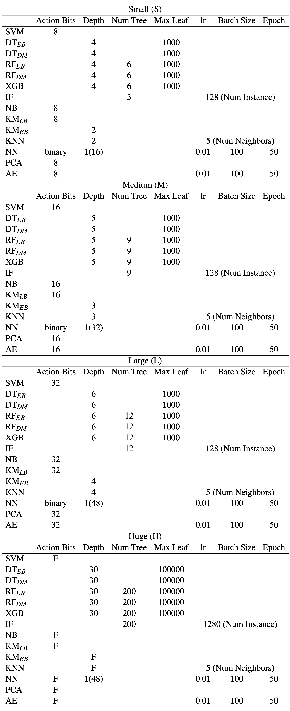

# Planter Supports


## A Guide to Evaluation Reproduction of the Paper.

All figures in Section~5 can be generated by the Python files, where the raw experiment data is hardcoded directly. All data can be generated by Planter, with detailed instructions available in ```./README.md```. A detailed explanation of the Planter's configuration for each experiment is provided below, aiding in the replication of the results used in the figures and tables.


### Model Hyperparameters

The figure below outlines the detailed hyperparameter configurations for each model. Hyperparameters for in-network ML model size (S, M, L, H) vary on a gradient scale. 'F' stands for Full precision, and 'lr' denotes learning rate. Huge models employ large hyperparameter values for full precision accuracy. Other hyperparameters for each model remain as the default values as defined in the scikit-learn package. This setup is used consistently for all evaluations.



### Model & Variation Selection
- **SwitchTree DT (DT<sub>DM</sub>)**: Model Type - DT, Variation - DM
- **pForest RF (RF<sub>DM</sub>)**: Model Type - RF, Variation - DM
- **IIsy KM (KM<sub>LB</sub>)**: Model Type - KM, Variation - LB
- **Clustreams KM (KM<sub>EB</sub>)**: Model Type - KM, Variation - EB
- **IIsy SVM (SVM<sub>LB</sub>)**: Model Type - SVM, Variation - LB
- **IIsy RF (RF<sub>EB</sub>)**: Model Type - RF, Variation - 1
- **N3IC/Taurus NN (NN<sub>DM</sub>)**: Model Type - NN, Variation - DM
- **Planter DT<sub>EB</sub>**: Model Type - DT, Variation - EB
- **Planter RF<sub>EB</sub>**: Model Type - RF, Variation - EB
- **Planter XGB**: Model Type - XGB, Variation - EB
- **Planter IF**: Model Type - IF, Variation - EB
- **Planter NB**: Model Type - NB, Variation - LB
- **Planter KNN**: Model Type - KNN, Variation - LB
- **Planter PCA**: Model Type - PCA, Variation - LB
- **Planter AE**: Model Type - AE, Variation - LB

### Dataset & Use Case Selection
- **UNSW**: Dataset - UNSW_5_tuple, Use Case - performance 
- **CICIDS**: Dataset - CICIDS_5_tuple, Use Case - performance 
- **UNSW Range**: Dataset - UNSW_5_tuple_range, Use Case - performance
### Target & Architecture Selection
- **Tofino**: Target - Tofino, Architecture - tna, mode - software
- **Tofino2**: Target - Tofino2, Architecture - tna, mode - software
- **BMv2**: Target - bmv2, Architecture - v1model, mode - software 


### System Performance Evaluation

The experiment environment uses APS-Networks BF6064X, an Intel Barefoot Tofino platform with 64x100G ports. The switch operates on Ubuntu 18.04.1, utilizing Barefoot's SDE 9.6.0. The software development environment uses SDE 9.4.0 (Tofino) / 9.9.0 (Tofino 2). For the NVIDIA environment setup, Spectrum's p4build compiler 1.0.18.2 is employed.

ESC4000A-E10 servers using AMD EPYC 7302P CPUs with 256GB RAM, Ubuntu 20.04LTS, and equipped Mellanox ConnectX-5 100G NICs are used to send traffic to the switch using DPDK 20.11.1 and PktGen 21.03.0. Each port is allocated four dedicated CPU cores.

Full throughput testing involves a snake configuration, looping traffic sequentially across all 64 ports. This configuration achieves 6.4Tbps throughput on the switch, with Python scripts managing traffic generation, capture, and verification.

The P4Pi environment uses Raspberry Pi 4 Model B with 8GB of RAM. It runs P4Pi code released v0.0.3.
The throughput test is conducted referring to the benchmark Python script for the BMv2 performance test with performance mode configured. The Raspberry Pi is set as P4Pi, running v1model over the BMv2 software switch. It is connected to another RPi as the client and a server with Intel(R) Xeon(R) W-2133 CPU @ 3.60GHz and 64 GB RAM.

