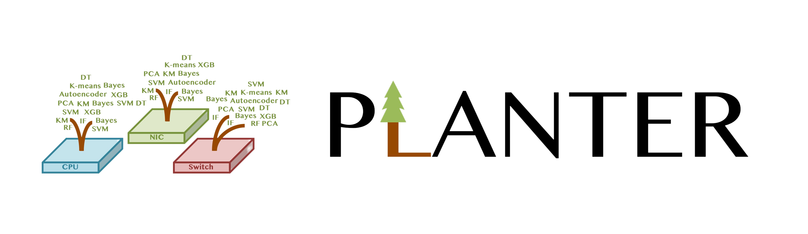

# Planter Supports

<aside>
💡 A guide to Planter supported datasets.

</aside>

## Supported datasets
Planter currently supports 7 datasets. 

**1. UNSW** [Link](https://research.unsw.edu.au/projects/unsw-nb15-dataset) - The UNSW dataset is a traditional anomaly detection dataset that contains 9 typical network attacks.

**2. KDD** [Link](http://kdd.ics.uci.edu/databases/kddcup99/kddcup99.html) - The KDD dataset is an old but traditional network intrusion detection dataset. 

**3. CICIDS** [Link](https://www.unb.ca/cic/datasets/ids-2017.html) - The CICIDS dataset is a network intrusion detection dataset with abstract behavior of 25 users and 7 different attacks.

**4. AWID3** [Link](https://icsdweb.aegean.gr/awid/awid3) - The AWID3 dataset is a network intrusion detection dataset with 13 different attacks. The data is collected from 16 different physical devices and VMs.

**5. Requet** [Link](https://github.com/Wimnet/RequetDataSet) - Requet is a Quality of Experience (QoE) metric detection dataset collected from video streaming services to give the records of video playback information.

**6. Jane Street Market** [Link](https://www.kaggle.com/c/jane-street-market-prediction) - Jane Street Markets is a high-frequency trading dataset with 500 days of historical data. Specifically, it contains 130 features.

**7. Iris** [Link](https://archive.ics.uci.edu/ml/datasets/iris) - The Iris dataset is one of the best-known datasets to be found in the pattern recognition literature. The dataset contains four features for three different types of Iris flowers. This dataset is mainly used for demos.
